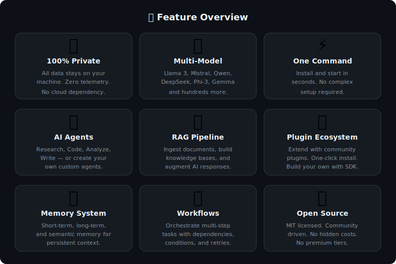
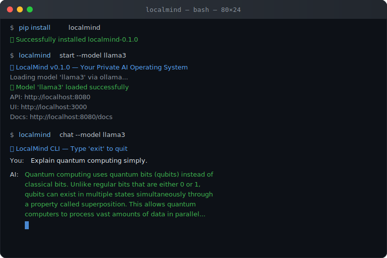
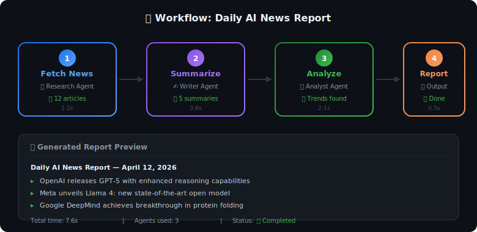
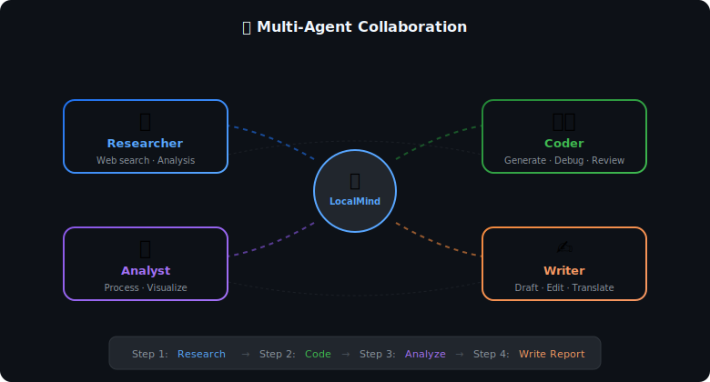
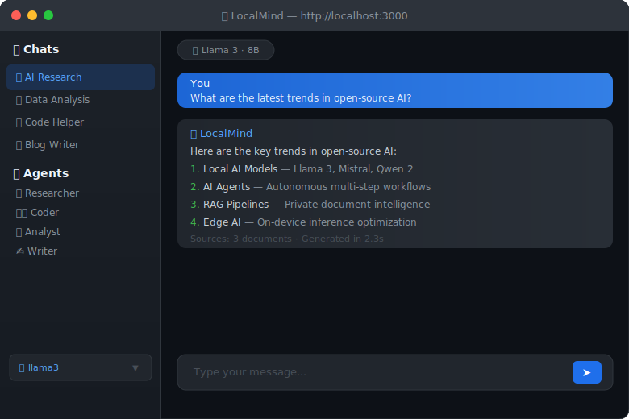

# LocalMind

<div align="center">

# 🧠 LocalMind

**Your Private AI Operating System — One Command to Full AI Experience**

[](https://pypi.org/project/localmind/)
[](https://www.python.org/downloads/)
[](https://opensource.org/licenses/MIT)
[](http://makeapullrequest.com)
[](https://discord.gg/localmind)

[English](README.md) | [中文](README_zh.md) | [日本語](README_ja.md)

*"The Linux of AI — Take back control of your artificial intelligence."*

</div>

<div align="center">


</div>

---

## 📖 Table of Contents

- [✨ What is LocalMind?](#-what-is-localmind)
- [🚀 Quick Start](#-quick-start)
- [🎯 Core Features](#-core-features)
- [🏗️ Architecture](#-architecture)
- [🔌 Plugin System](#-plugin-system)
- [📚 Documentation](#-documentation)
- [🤝 Contributing](#-contributing)
- [🗺️ Roadmap](#-roadmap)
- [❓ FAQ](#-faq)
- [📜 License](#-license)

---

## ✨ What is LocalMind?

**LocalMind** is an open-source, privacy-first AI operating system that runs entirely on your local machine. It unifies model management, intelligent agents, plugin ecosystem, and workflow orchestration into a single, beautiful interface.

### 🎯 The Problem We Solve

Today's AI landscape is fragmented:
- 🔴 **Ollama** runs models but has no agent capabilities
- 🔴 **LangChain** builds agents but needs complex setup
- 🔴 **Open WebUI** provides chat but lacks automation
- 🔴 **AutoGPT** automates but is unreliable and hard to control

**LocalMind brings it all together** — one platform, infinite possibilities, zero data leaves your machine.

<div align="center">



</div>

### 💡 Why LocalMind?

| Feature | LocalMind | Ollama | LangChain | Open WebUI | AutoGPT |
|---------|-----------|--------|-----------|------------|---------|
| Local Model Management | ✅ | ✅ | ❌ | ✅ | ❌ |
| AI Agent System | ✅ | ❌ | ✅ | ❌ | ✅ |
| Plugin Ecosystem | ✅ | ❌ | Partial | ❌ | ❌ |
| Visual Workflow Builder | ✅ | ❌ | ❌ | ❌ | ❌ |
| RAG Pipeline | ✅ | ❌ | ✅ | ✅ | ❌ |
| Memory & Context | ✅ | ❌ | Partial | Partial | ✅ |
| Multi-Model Support | ✅ | ✅ | ✅ | ✅ | ❌ |
| Web UI | ✅ | ❌ | ❌ | ✅ | ❌ |
| CLI Interface | ✅ | ✅ | ❌ | ❌ | ✅ |
| Privacy-First | ✅ | ✅ | ❌ | ✅ | ✅ |
| One-Command Install | ✅ | ✅ | ❌ | ✅ | ❌ |

---

## 🚀 Quick Start

### Installation

```bash
# One command to install everything
pip install localmind

# Or install with all optional dependencies
pip install "localmind[all]"

# Or clone and install from source
git clone https://github.com/song-chaoyang/localmind-ai.git
cd localmind
pip install -e ".[all]"
```

### Launch Your AI OS

```bash
# Launch with Web UI (default)
localmind start

# Launch CLI only mode
localmind start --cli

# Launch with specific model
localmind start --model llama3

# Launch headless (API server only)
localmind start --headless --port 8080
```

That's it! Open `http://localhost:3000` in your browser and start chatting with your private AI.

<div align="center">



</div>

> 💡 **Tip**: Make sure [Ollama](https://ollama.ai) is installed and running. Then run `ollama pull llama3` to download the model.

### First Conversation

```python
from localmind import LocalMind

# Initialize your AI OS
mind = LocalMind()

# Download and load a model (first run may take a few minutes)
mind.load_model("llama3")

# Start chatting
response = mind.chat("Hello! Can you help me analyze my data?")
print(response)
```

### Use AI Agents

```python
from localmind import LocalMind
from localmind.agents import ResearchAgent, CodeAgent, DataAgent

mind = LocalMind()
mind.load_model("llama3")

# Create specialized agents
researcher = ResearchAgent(mind)
coder = CodeAgent(mind)
analyst = DataAgent(mind)

# Let agents collaborate
result = mind.collaborate(
    agents=[researcher, coder, analyst],
    task="Research the latest AI trends and build a demo"
)
print(result)
```

### Build a Workflow

```python
from localmind import LocalMind
from localmind.core import Workflow

mind = LocalMind()
mind.load_model("llama3")

# Define a workflow
workflow = Workflow("Daily Report Generator")

# Add steps
workflow.add_step("fetch_news", agent="research", input="AI news today")
workflow.add_step("summarize", agent="writer", depends_on="fetch_news")
workflow.add_step("format_report", agent="formatter", depends_on="summarize")

# Execute
result = workflow.run(mind)
print(result)
```

<div align="center">



</div>

---

## 🎯 Core Features

### 🤖 Intelligent Agent System
- **Pre-built Agents**: Research, Coding, Data Analysis, Writing, Translation, and more
- **Custom Agents**: Create your own agents with simple Python classes
- **Multi-Agent Collaboration**: Agents work together on complex tasks
- **Tool Integration**: Agents can use web search, file I/O, code execution, and more

<div align="center">



</div>

### 🔌 Plugin Ecosystem
- **One-click Install**: `localmind plugin install <name>`
- **Community Plugins**: Browse and share plugins in the marketplace
- **Easy Development**: Build plugins with our simple SDK
- **Hot Reload**: Develop plugins without restarting

### 📊 RAG (Retrieval-Augmented Generation)
- **Document Ingestion**: PDF, DOCX, TXT, Markdown, code files
- **Vector Store**: Built-in vector database with multiple backends
- **Smart Chunking**: Automatic document splitting and embedding
- **Hybrid Search**: Combine semantic and keyword search

### 🧠 Memory System
- **Short-term Memory**: Conversation context management
- **Long-term Memory**: Persistent knowledge storage
- **Semantic Memory**: Auto-organized knowledge graph
- **Episodic Memory**: Remember past interactions

### 🎨 Beautiful Web UI
- **Modern Interface**: Clean, responsive design
- **Real-time Streaming**: See responses as they're generated
- **Dark/Light Mode**: Your preference, always
- **Mobile Friendly**: Use on any device

<div align="center">



</div>

### 🔒 Privacy & Security
- **100% Local**: All data stays on your machine
- **No Telemetry**: We don't track anything
- **Sandboxed Execution**: Code runs in isolated environments
- **Encrypted Storage**: Your data is encrypted at rest

---

## 🏗️ Architecture

<div align="center">


</div>

```
localmind/
├── src/
│   ├── core/           # Core engine, config, workflow engine
│   │   ├── engine.py   # Main LocalMind engine
│   │   ├── config.py   # Configuration management
│   │   ├── memory.py   # Memory system
│   │   ├── workflow.py # Workflow orchestration
│   │   └── events.py   # Event bus system
│   ├── models/         # Model management & abstraction
│   │   ├── manager.py  # Model download & lifecycle
│   │   ├── base.py     # Base model interface
│   │   └── providers/  # Ollama, llama.cpp, vLLM providers
│   ├── agents/         # Agent system
│   │   ├── base.py     # Base agent class
│   │   ├── builtin/    # Built-in agents
│   │   └── tools/      # Agent tools
│   ├── plugins/        # Plugin system
│   │   ├── loader.py   # Plugin loader
│   │   ├── registry.py # Plugin registry
│   │   └── sdk.py      # Plugin SDK
│   ├── api/            # REST & WebSocket API
│   │   ├── server.py   # FastAPI server
│   │   ├── routes/     # API routes
│   │   └── websocket.py# WebSocket handler
│   ├── ui/             # Web UI (Svelte/React)
│   │   └── ...
│   └── utils/          # Shared utilities
├── tests/              # Comprehensive test suite
├── examples/           # Usage examples
├── docs/               # Documentation
└── scripts/            # Utility scripts
```

### Design Principles

1. **Modular**: Every component is pluggable and replaceable
2. **Extensible**: Easy to add new models, agents, plugins, and tools
3. **Performant**: Async-first, lazy loading, efficient memory usage
4. **Secure**: Sandboxed execution, encrypted storage, no data leakage
5. **Beautiful**: Clean code, comprehensive docs, delightful UX

---

## 🔌 Plugin System

### Installing Plugins

```bash
# From the marketplace
localmind plugin install web-search
localmind plugin install code-executor
localmind plugin install image-generator

# From a Git repository
localmind plugin install https://github.com/user/my-plugin

# List installed plugins
localmind plugin list
```

### Creating a Plugin

```python
# my_plugin.py
from localmind.plugins import Plugin, plugin_metadata

@plugin_metadata(
    name="my-awesome-plugin",
    version="1.0.0",
    description="Does awesome things",
    author="Your Name"
)
class MyAwesomePlugin(Plugin):
    def on_load(self):
        """Called when the plugin is loaded"""
        self.logger.info("MyAwesomePlugin loaded!")

    def on_chat_message(self, message, context):
        """Called on every chat message"""
        # Process or enhance messages
        return message

    def register_tools(self):
        """Register tools for agents to use"""
        return [
            {
                "name": "my_tool",
                "description": "My custom tool",
                "function": self.my_tool_function
            }
        ]

    def my_tool_function(self, query: str) -> str:
        """Tool implementation"""
        return f"Result for: {query}"
```

---

## 📚 Documentation

- [📖 Getting Started Guide](docs/getting-started.md)
- [🔧 Configuration Reference](docs/configuration.md)
- [🤖 Agent Development Guide](docs/agent-development.md)
- [🔌 Plugin Development Guide](docs/plugin-development.md)
- [🧠 Memory System Deep Dive](docs/memory-system.md)
- [📊 RAG Pipeline Guide](docs/rag-pipeline.md)
- [🎨 UI Customization](docs/ui-customization.md)
- [🌐 API Reference](docs/api-reference.md)
- [🚀 Deployment Guide](docs/deployment.md)

---

## 🤝 Contributing

We ❤️ contributions! LocalMind is built by the community, for the community.

### Quick Contribution Guide

1. **Fork** the repository
2. **Create** a feature branch: `git checkout -b feature/amazing-feature`
3. **Commit** your changes: `git commit -m 'Add amazing feature'`
4. **Push** to the branch: `git push origin feature/amazing-feature`
5. **Open** a Pull Request

See [CONTRIBUTING.md](CONTRIBUTING.md) for detailed guidelines.

### Areas We Need Help With

- 🌍 **Translations**: Help translate LocalMind to your language
- 📚 **Documentation**: Improve docs, add tutorials
- 🐛 **Bug Fixes**: Check out issues labeled "good first issue"
- ✨ **Features**: Propose and implement new features
- 🔌 **Plugins**: Build and share plugins
- 🧪 **Testing**: Improve test coverage

---

## 🗺️ Roadmap

### v0.1.0 (Current) — Foundation ✅
- [x] Core engine and configuration system
- [x] Model management (Ollama integration)
- [x] Basic chat interface (CLI + Web UI)
- [x] Built-in agents (Research, Code, Data, Writer)
- [x] Plugin system with SDK
- [x] RAG pipeline with document ingestion
- [x] Memory system (short-term + long-term)
- [x] REST API and WebSocket support

### v0.2.0 — Intelligence 🔄
- [ ] Multi-agent collaboration framework
- [ ] Visual workflow builder (drag-and-drop)
- [ ] Advanced RAG with hybrid search
- [ ] Code execution sandbox
- [ ] Web browsing agent tool
- [ ] Image generation integration
- [ ] Speech-to-text / text-to-speech

### v0.3.0 — Ecosystem 📋
- [ ] Plugin marketplace
- [ ] Model marketplace
- [ ] Agent sharing platform
- [ ] Workflow templates
- [ ] Community hub
- [ ] Mobile app (iOS/Android)

### v1.0.0 — Revolution 🚀
- [ ] Distributed AI (multi-node)
- [ ] Federated learning
- [ ] AI model fine-tuning UI
- [ ] Enterprise features (SSO, RBAC, audit logs)
- [ ] Cloud sync (optional, encrypted)
- [ ] Hardware acceleration optimization

---

## ❓ FAQ

### Q: Does LocalMind send my data anywhere?
**A: No.** LocalMind is designed to be 100% local. No data leaves your machine unless you explicitly configure it to do so. There is zero telemetry.

### Q: What models does LocalMind support?
**A:** LocalMind supports any model that Ollama supports, including Llama 3, Mistral, Qwen, DeepSeek, Phi-3, Gemma, and hundreds more. We also support custom GGUF models.

### Q: What are the hardware requirements?
**A:**
- **Minimum**: 8GB RAM, any modern CPU (will be slow)
- **Recommended**: 16GB+ RAM, Apple Silicon M1+ or NVIDIA GPU
- **Optimal**: 32GB+ RAM, dedicated GPU with 8GB+ VRAM

### Q: How is LocalMind different from Ollama?
**A:** Ollama is a model runner. LocalMind is a complete AI operating system that uses Ollama (and other backends) to run models, then adds agents, plugins, RAG, memory, workflows, and a beautiful UI on top.

### Q: Can I use cloud models (OpenAI, Anthropic) with LocalMind?
**A:** Yes, LocalMind supports multiple model providers. You can use local models for privacy-sensitive tasks and cloud models when you need more power. This is configurable per-agent.

### Q: Is LocalMind free?
**A:** Yes! LocalMind is 100% free and open source under the MIT license. No hidden costs, no premium tiers, no data harvesting.

---

## 🙏 Acknowledgments

- [Ollama](https://github.com/ollama/ollama) — Amazing local model runner
- [Hugging Face](https://huggingface.co/) — Open AI community
- [LangChain](https://github.com/langchain-ai/langchain) — LLM application framework inspiration
- [LlamaIndex](https://github.com/run-llama/llama_index) — RAG pipeline inspiration
- [Open WebUI](https://github.com/open-webui/open-webui) — Beautiful UI inspiration
- [Sentence Transformers](https://www.sbert.net/) — Embedding models

---

## 📜 License

LocalMind is released under the [MIT License](LICENSE).

---

<div align="center">

**Made with ❤️ by the LocalMind Community**

*"The future of AI is local, private, and free."*

[⭐ Star us on GitHub](https://github.com/song-chaoyang/localmind-ai) — It helps more than you think!

</div>
