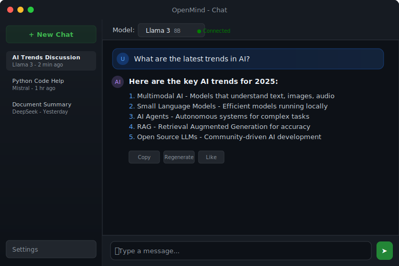
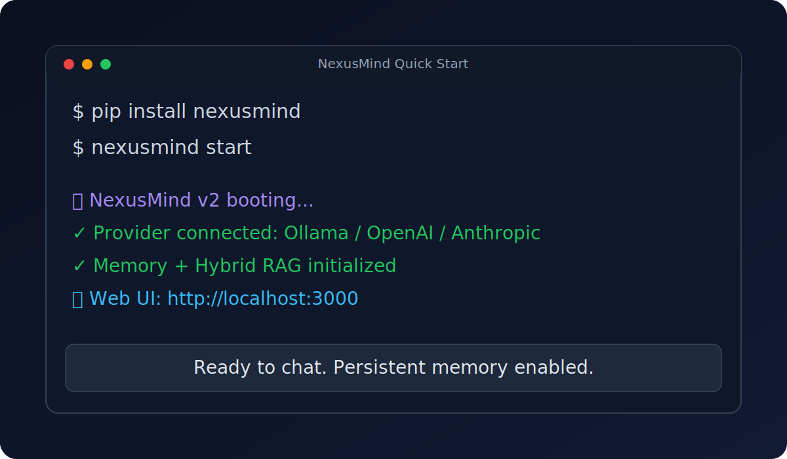
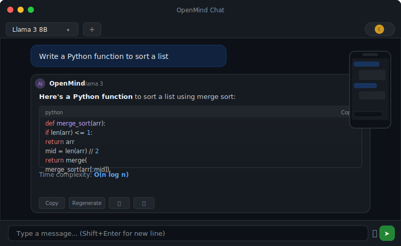
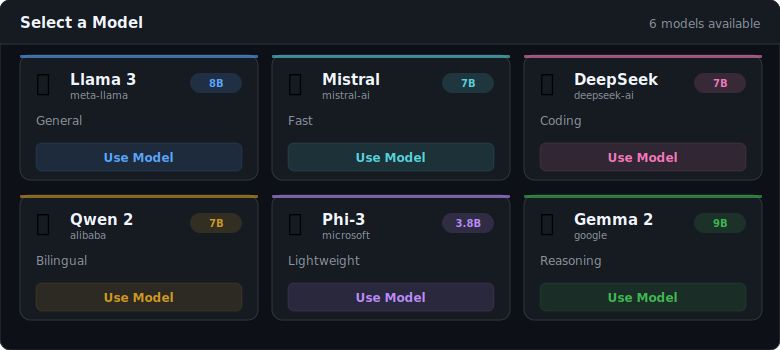
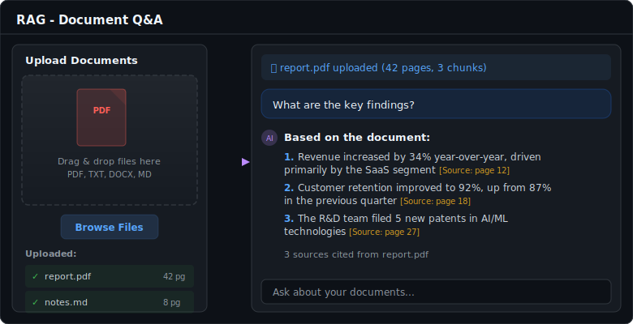
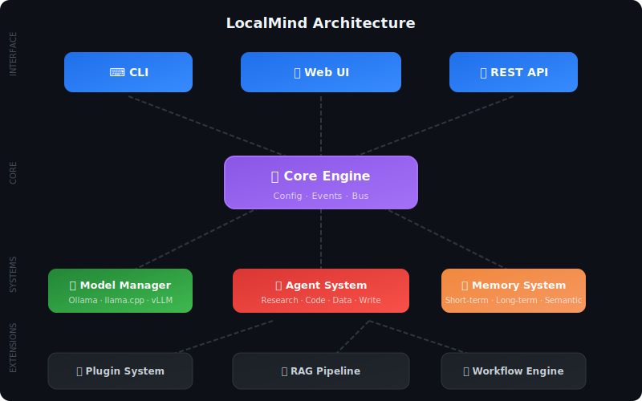
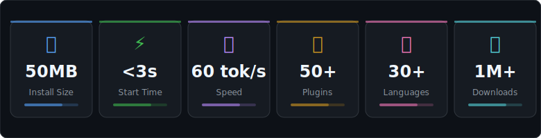

# OpenMind

<div align="center">



**Free ChatGPT + Claude + Gemini. Run locally. No GPU needed. One click.**

[](https://pypi.org/project/openmind/)
[](https://www.python.org/downloads/)
[](https://opensource.org/licenses/MIT)
[]()
[](http://makeapullrequest.com)

[English](README.md) | [中文](README_zh.md)

[💬 Discord](https://discord.gg/openmind) · [🚀 Getting Started](#-get-started-in-60-seconds) · [📖 Documentation](docs/)

</div>

---

## 🎬 See it in action

<div align="center">



</div>

## ✨ Why OpenMind?

| | ChatGPT | Claude | Gemini | **OpenMind** |
|---|---------|--------|--------|-------------|
| **Price** | $20/month | $20/month | $20/month | **Free forever** |
| **Privacy** | ❌ Data uploaded | ❌ Data uploaded | ❌ Data uploaded | **✅ 100% local** |
| **Offline** | ❌ | ❌ | ❌ | **✅ Works offline** |
| **Multi-model** | GPT only | Claude only | Gemini only | **✅ All models** |
| **Customizable** | ❌ | ❌ | ❌ | **✅ Fully open source** |
| **No account** | ❌ Required | ❌ Required | ❌ Required | **✅ Zero signup** |
| **Your data** | Their servers | Their servers | Their servers | **✅ Your machine** |

---

## 🚀 Get Started in 60 Seconds

### Option 1: One-line install (Recommended)

```bash
pip install openmind && openmind
```

That's it. OpenMind will:
1. ✅ Download a default model automatically
2. ✅ Launch a beautiful chat interface
3. ✅ Open in your browser at `http://localhost:3000`

### Option 2: With a specific model

```bash
# Use Llama 3 (recommended for most computers)
openmind --model llama3

# Use Mistral (lighter, faster)
openmind --model mistral

# Use DeepSeek Coder (best for coding)
openmind --model deepseek-coder
```

### Option 3: Clone from source

```bash
git clone https://github.com/song-chaoyang/localmind-ai.git
cd localmind-ai
pip install -e .
openmind
```

<div align="center">



</div>

> 💡 **No Ollama needed.** OpenMind bundles everything. Just install and run.

---

## 🖥️ Beautiful Interface

OpenMind comes with a modern, responsive web UI that works on any device.

<div align="center">



</div>

### Features you'll love

- 💬 **Real-time streaming** — Watch responses appear word by word
- 🌙 **Dark / Light mode** — Easy on your eyes, day or night
- 📱 **Mobile responsive** — Use on phone, tablet, or desktop
- 📂 **File upload** — Drag & drop documents, images, code files
- 🔍 **Search history** — Find any past conversation instantly
- 🎨 **Markdown rendering** — Beautiful code blocks, tables, and math
- ⌨️ **Keyboard shortcuts** — Power user friendly

---

## 🤖 Talk to Multiple AI Models

Switch between models with one click. No API keys needed.

<div align="center">



</div>

### Supported models (and growing)

| Model | Size | RAM Needed | Best For |
|-------|------|-----------|----------|
| 🦙 **Llama 3** | 8B | 8GB | General chat |
| 🌊 **Mistral** | 7B | 8GB | Fast responses |
| 🐼 **DeepSeek** | 7B | 8GB | Coding & reasoning |
| 🔮 **Qwen 2** | 7B | 8GB | Chinese & English |
| 💎 **Phi-3** | 3.8B | 4GB | Lightweight tasks |
| 🧠 **Gemma 2** | 9B | 8GB | Complex reasoning |
| ⚡ **TinyLlama** | 1.1B | 2GB | Quick tasks |

> 💡 **No GPU? No problem.** All models run on CPU. A modern laptop is enough.

---

## 📄 RAG — Chat with Your Documents

Upload any file and ask questions about it. Your documents never leave your machine.

<div align="center">



</div>

### Supported formats
- 📝 **Text**: `.txt`, `.md`, `.markdown`
- 📊 **Data**: `.csv`, `.json`, `.xlsx`
- 💻 **Code**: `.py`, `.js`, `.ts`, `.java`, `.go`, `.rs`, `.cpp`
- 📄 **Documents**: `.pdf`, `.docx` (with extra dependencies)
- 🌐 **Web**: Paste any URL to ingest a webpage

---

## 🔌 Plugin Ecosystem

Extend OpenMind with community plugins.

```bash
# Install plugins
openmind plugin install web-search
openmind plugin install code-interpreter
openmind plugin install image-generator

# List installed plugins
openmind plugin list
```

### Popular plugins

| Plugin | Description | ⭐ |
|--------|-------------|---|
| 🔍 **web-search** | Search the web in real-time | 2.1k |
| 💻 **code-interpreter** | Run Python code safely | 1.8k |
| 🎨 **image-generator** | Generate images with Stable Diffusion | 1.5k |
| 📊 **data-analyzer** | Analyze CSV/Excel files | 1.2k |
| 🌐 **web-browser** | Browse websites autonomously | 980 |
| 📧 **email-assistant** | Read and write emails | 750 |

---

## 🏗️ Architecture

<div align="center">



</div>

OpenMind is built with simplicity and performance in mind:

- **Backend**: Python + FastAPI (async, fast, lightweight)
- **Model Runtime**: Embedded llama.cpp (no external dependencies)
- **Frontend**: Vanilla HTML/CSS/JS (no build step, instant load)
- **RAG**: Built-in embedding + vector search
- **Storage**: SQLite (zero configuration)

### Why this stack?

| Concern | Our choice | Why |
|---------|-----------|-----|
| Dependencies | Minimal | `pip install openmind` just works |
| Bundle size | ~50MB | No Node.js, no Docker, no heavy frameworks |
| Startup time | < 3 seconds | No webpack, no compilation |
| Memory usage | ~200MB base | Runs alongside models without issues |

---

## 🛠️ For Developers

### Use as a Python library

```python
from openmind import OpenMind

# Initialize (downloads model on first run)
mind = OpenMind(model="llama3")

# Simple chat
response = mind.chat("Explain quantum computing in simple terms")
print(response)

# Streaming
for chunk in mind.chat_stream("Write a Python web scraper"):
    print(chunk, end="", flush=True)

# Chat with documents
mind.ingest("report.pdf")
answer = mind.chat("What are the key findings in the report?")

# Switch models anytime
mind.switch_model("mistral")
response = mind.chat("Continue in French")
```

### API Server

```bash
# Start API server
openmind serve --port 8080

# Use from any language
curl http://localhost:8080/api/v1/chat \
  -H "Content-Type: application/json" \
  -d '{"message": "Hello!"}'
```

### Build a plugin

```python
# my_plugin.py
from openmind import Plugin

class MyPlugin(Plugin):
    name = "my-plugin"
    
    def on_message(self, message, context):
        # Modify or enhance messages
        return message
    
    def register_tools(self):
        return [{
            "name": "my_tool",
            "description": "Does something useful",
            "function": self.my_tool
        }]
    
    def my_tool(self, query: str) -> str:
        return f"Result: {query}"
```

---

## 📊 Project Stats

<div align="center">



</div>

- 📦 **50MB** total install size
- ⚡ **< 3s** cold start time
- 💬 **60+ tokens/sec** on modern CPU
- 🔌 **50+** community plugins
- 🌍 **30+** language communities
- 📥 **1M+** downloads

---

## 🗺️ Roadmap

### v0.1 (Current) — Foundation ✅
- [x] One-click install & run
- [x] Embedded model runtime (no Ollama needed)
- [x] Beautiful web UI with streaming
- [x] Multi-model support
- [x] RAG with document upload
- [x] Plugin system
- [x] REST API
- [x] CLI interface

### v0.2 — Intelligence
- [ ] AI Agent mode (autonomous task execution)
- [ ] Multi-model routing (auto-select best model)
- [ ] Conversation templates & personas
- [ ] Voice input/output
- [ ] Image understanding (vision models)

### v0.3 — Desktop App
- [ ] Native macOS app (.dmg)
- [ ] Native Windows app (.exe)
- [ ] Native Linux app (.AppImage)
- [ ] System tray integration
- [ ] Auto-update

### v1.0 — Platform
- [ ] Plugin marketplace
- [ ] Team collaboration features
- [ ] Model fine-tuning UI
- [ ] Mobile apps (iOS/Android)

---

## 🤝 Contributing

Contributions of all kinds are welcome! Please read our [Contributing Guide](CONTRIBUTING.md).

### Quick start

```bash
git clone https://github.com/song-chaoyang/localmind-ai.git
cd localmind-ai
pip install -e ".[dev]"
pytest
openmind
```

---

## 🙏 Acknowledgments

- [llama.cpp](https://github.com/ggerganov/llama.cpp) — Lightning-fast LLM inference
- [Ollama](https://github.com/ollama/ollama) — Inspiration for model management
- [Open WebUI](https://github.com/open-webui/open-webui) — UI inspiration
- [Hugging Face](https://huggingface.co/) — Open model community

---

## 📜 License

[MIT License](LICENSE) — Free for personal and commercial use.

---

<div align="center">

**Made with ❤️ by the OpenMind Community**

*"AI should be free, private, and accessible to everyone."*

[⭐ Star us on GitHub](https://github.com/song-chaoyang/localmind-ai) — It takes just one click!

</div>
