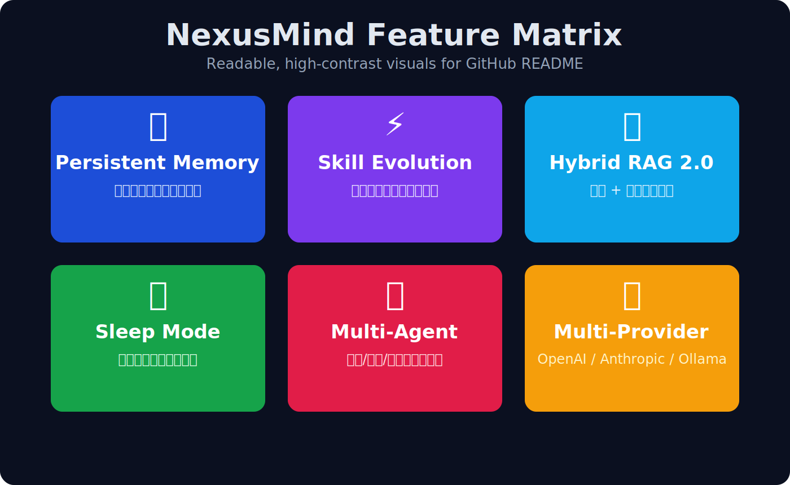
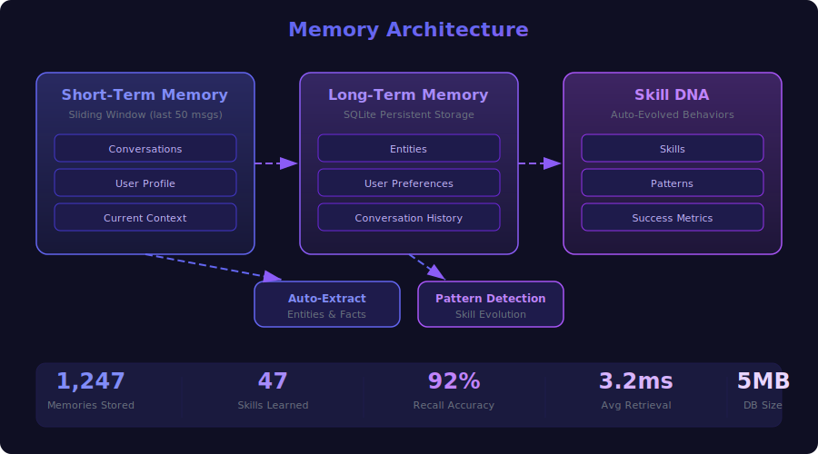
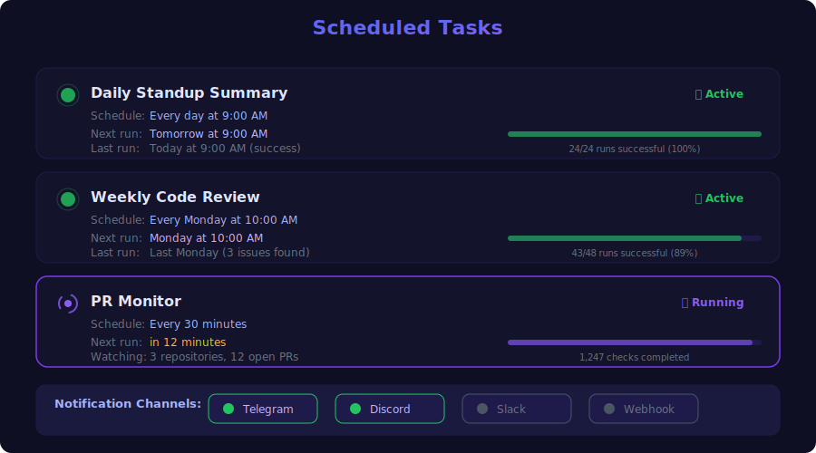
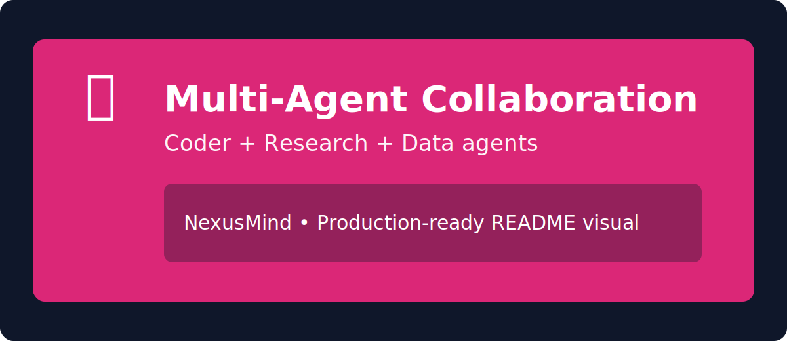

<div align="center">


# NexusMind

**Your Second Brain. Always Online. Self-Evolving.**

The open-source AI assistant that remembers everything, learns from every interaction, and works while you sleep.


`pip install nexusmind && nexusmind`


---



</div>

## Why NexusMind?

Every AI assistant resets when you close the tab. **NexusMind doesn't.**

### The Problem

- ChatGPT forgets your project context every session
- Claude Code doesn't remember your coding patterns
- No AI tool learns from your repeated workflows
- You can't schedule AI tasks to run while you're away

### The Solution

**NexusMind combines the best ideas from [Hermes Agent](https://github.com/NousResearch/hermes-agent) and [Claw Code](https://github.com/ultraworkers/claw-code):**

| Feature | Hermes Agent | Claw Code | **NexusMind** |
|---------|:------------:|:---------:|:-------------:|
| Persistent Memory | :white_check_mark: | :x: | :white_check_mark: |
| Auto Skill Evolution | :white_check_mark: | :x: | :white_check_mark: |
| Offline Scheduling | :white_check_mark: | :x: | :white_check_mark: |
| Multi-Agent System | :x: | :white_check_mark: | :white_check_mark: |
| Multi-Provider LLM | :white_check_mark: | :white_check_mark: | :white_check_mark: |
| Beautiful Web UI | :white_check_mark: | :x: | :white_check_mark: |
| Zero Config Setup | :x: | :x: | :white_check_mark: |
| Self-Hosted | :white_check_mark: | :white_check_mark: | :white_check_mark: |

> **One line summary:** NexusMind is the only open-source AI assistant that gives you persistent memory, self-evolving skills, offline scheduling, AND multi-agent collaboration -- all in a single, beautiful, self-hosted package.

---

## Key Features

### Persistent Memory



NexusMind remembers everything about you and your projects:

- Your tech stack, coding style, and preferences
- Project context across sessions
- Auto-extracted entities (people, projects, technologies)
- Semantic search through all memories

<br clear="right"/>

### Auto Skill Evolution



NexusMind learns from every interaction:

- Detects repeated patterns in your workflow
- Auto-creates reusable skills
- Skills improve with usage (tracks success rate)
- Export/import skills between instances
- Generate your **"Skill DNA"** fingerprint

<br clear="right"/>

### Sleep Mode Agent



Schedule tasks that run while you sleep:

- "Review my PRs every morning at 9 AM"
- "Run test suite every 30 minutes"
- "Send weekly summary every Friday"
- Results delivered to Telegram, Discord, or Slack

<br clear="right"/>

### Multi-Agent Collaboration



Specialized agents working together:

- **Coder Agent** -- Code generation, review, debugging
- **Research Agent** -- Documentation, web research
- **Data Agent** -- Analysis, visualization
- All agents share the same memory system

<br clear="right"/>

### Multi-Provider Support

Connect to any LLM provider:

| Provider | Models | Cost | GPU Required |
|----------|--------|------|:------------:|
| **Ollama** | Llama 3, Mistral, Qwen, Phi | Free | :x: |
| **OpenAI** | GPT-4, GPT-4o | Paid | :x: |
| **Anthropic** | Claude 3.5, Claude Opus | Paid | :x: |
| **OpenRouter** | 100+ models | Varies | :x: |

Switch providers with a single command -- no code changes needed.

---

## Quick Start

### Prerequisites

- Python 3.10 or higher
- One LLM provider (Ollama for free local inference, or an API key for cloud providers)

### Install

```bash
pip install nexusmind
```

### Start with Ollama (Free & Local, No GPU)

```bash
# 1. Install Ollama: https://ollama.ai
# 2. Pull a model
ollama pull llama3

# 3. Launch NexusMind
nexusmind start
```

### Start with OpenAI

```bash
export OPENAI_API_KEY=sk-...
nexusmind start --provider openai --model gpt-4o
```

### Start with Anthropic

```bash
export ANTHROPIC_API_KEY=sk-ant-...
nexusmind start --provider anthropic --model claude-opus-4-20250514
```

Open **http://localhost:3000** and start chatting!

---

## Documentation

### CLI Commands

```bash
nexusmind start            # Launch Web UI + API server
nexusmind chat             # Interactive terminal chat
nexusmind model list       # List available models
nexusmind model pull       # Pull a model (Ollama)
nexusmind memory search    # Search through memories
nexusmind skill list       # List learned skills
nexusmind skill export     # Export skills to JSON
nexusmind skill import     # Import skills from JSON
nexusmind schedule list    # List scheduled tasks
nexusmind schedule add     # Add a new scheduled task
nexusmind ingest <file>    # Ingest a document into memory
```

### API Endpoints

```bash
# Chat
POST   /api/v1/chat              # Send a message
POST   /api/v1/chat/stream       # Stream response (SSE)

# Models
GET    /api/v1/models            # List available models
GET    /api/v1/models/{id}       # Get model details

# Memory
GET    /api/v1/memory            # Browse memories
POST   /api/v1/memory/search     # Semantic search
DELETE /api/v1/memory/{id}       # Delete a memory

# Skills
GET    /api/v1/skills            # List learned skills
GET    /api/v1/skills/{id}       # Get skill details
POST   /api/v1/skills/export     # Export skills
POST   /api/v1/skills/import     # Import skills

# Scheduler
GET    /api/v1/scheduler/tasks   # List scheduled tasks
POST   /api/v1/scheduler/tasks   # Create a scheduled task
DELETE /api/v1/scheduler/tasks/{id}  # Delete a task

# Ingestion
POST   /api/v1/ingest            # Ingest documents into memory
```

### Configuration

NexusMind works out of the box with zero configuration. For advanced settings, create a `nexusmind.yaml` in your project root:

```yaml
provider:
  name: ollama
  model: llama3
  base_url: http://localhost:11434

memory:
  max_memories: 10000
  embedding_model: all-MiniLM-L6-v2

scheduler:
  enabled: true
  timezone: UTC

server:
  host: 0.0.0.0
  port: 3000

notifications:
  telegram:
    bot_token: ""
    chat_id: ""
  discord:
    webhook_url: ""
```

---

## Architecture

NexusMind is built with a modular, extensible architecture:

```
nexusmind/
├── api/            # FastAPI server & WebSocket endpoints
├── core/
│   ├── engine.py       # Main orchestration engine
│   ├── memory.py       # Persistent memory with vector search
│   ├── skills.py       # Auto skill evolution system
│   ├── scheduler.py    # Cron-based task scheduler
│   ├── agents.py       # Multi-agent collaboration
│   ├── providers.py    # LLM provider abstraction
│   └── rag.py          # Retrieval-augmented generation
├── static/         # Web UI (HTML/CSS/JS)
├── utils/          # Shared utilities
└── cli.py          # Command-line interface
```

**Key design decisions:**

- **Provider-agnostic**: Swap any LLM without changing your code
- **Memory-first**: Every interaction enriches the shared knowledge base
- **Skill-driven**: Repeated patterns become reusable, improvable skills
- **Event-sourced**: Full audit trail of all actions and decisions

---

## Roadmap

- [ ] Plugin system for custom agents
- [ ] Voice input/output support
- [ ] Mobile-responsive Web UI
- [ ] Docker one-click deployment
- [ ] Skill marketplace (share skills with the community)
- [ ] Git integration (auto-commit, PR review)
- [ ] MCP (Model Context Protocol) support

---

## Contributing

We love contributions! Whether it's a bug fix, new feature, or documentation improvement.

### Getting Started

1. Fork the repository
2. Clone your fork: `git clone https://github.com/your-username/nexusmind.git`
3. Install dev dependencies: `pip install -e ".[dev]"`
4. Run tests: `pytest tests/`
5. Create a feature branch: `git checkout -b feature/my-feature`
6. Commit and push: `git commit -m "Add my feature" && git push`
7. Open a Pull Request

### Code Style

- Follow PEP 8
- Add type hints to all functions
- Write tests for new features
- Keep PRs small and focused

---

## License

This project is licensed under the **MIT License** -- free for personal and commercial use.

See [LICENSE](LICENSE) for the full text.

---

## Inspiration

NexusMind stands on the shoulders of giants:

- [Hermes Agent](https://github.com/NousResearch/hermes-agent) -- Persistent memory and skill evolution concepts
- [Claw Code](https://github.com/ultraworkers/claw-code) -- Autonomous multi-agent coding
- [Open WebUI](https://github.com/open-webui/open-webui) -- Beautiful AI interface design
- [MemGPT](https://github.com/cpacker/memgpt) -- Virtual context management
- [AutoGPT](https://github.com/Significant-Gravitas/AutoGPT) -- Autonomous AI agent framework

---

<div align="center">

**Made with :heart: by the NexusMind Contributors**

If you find this useful, please consider giving it a :star:!

</div>
